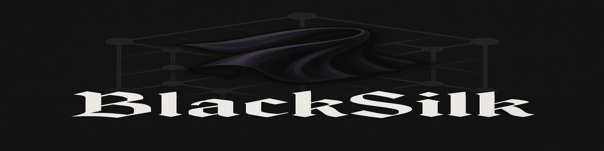

<!-- Logo Banner -->
<p align="center">
  
</p>

<!-- Project Icon -->
<p align="center">
  
</p>

# BlackSilk Blockchain

<!-- Favicon for browser tab (if supported by renderer) -->
<!-- <link rel="icon" type="image/png" href="assets/images/favicon_32x32 (2).png"> -->

## Overview
BlackSilk is a next-generation, privacy-focused blockchain and decentralized marketplace inspired by Monero, Bitcoin, and the Silk Road. It is designed for maximum censorship resistance, privacy, and security, leveraging state-of-the-art cryptography, anonymous networking, and a robust, open-source implementation stack.

---

## Table of Contents
- [Project Vision](#project-vision)
- [Blockchain Architecture](#blockchain-architecture)
- [Tokenomics](#tokenomics)
- [Privacy & Cryptography](#privacy--cryptography)
- [Network Layer & Anonymity](#network-layer--anonymity)
- [Marketplace Design](#marketplace-design)
- [Development Stack](#development-stack)
- [Security Enhancements](#security-enhancements)
- [Optional Enhancements](#optional-enhancements)
- [Naming Conventions & Inspiration](#naming-conventions--inspiration)
- [Documentation Deliverables](#documentation-deliverables)
- [Project Status](#project-status)
- [Build & Usage Instructions](#build--usage-instructions)
- [Contributing](#contributing)
- [License](#license)

---

## Project Vision
BlackSilk aims to provide a censorship-resistant, privacy-preserving blockchain and marketplace, empowering users to transact and communicate freely, securely, and anonymously. The project is built on the principles of freedom, privacy, and decentralization.

---

## Blockchain Architecture
- **Consensus:** Proof-of-Work (PoW) using Monero’s RandomX RX/0 algorithm, optimized for CPU mining.
- **Block Time:** 120 seconds (2 minutes).
- **Difficulty Retargeting:** Automatic, to maintain block time window.
- **Genesis Block Reward:** 5 BLK.
- **Halving:** Block reward halves every 1,051,200 blocks (~4 years).
- **Supply Cap:** 21 million BLK (mirrors Bitcoin’s cap, but with Monero-style mining).
- **Tail Emission:** None. After 21M BLK, only transaction fees are paid to miners (no further emission).

---

## Tokenomics
BlackSilk’s tokenomics are designed for long-term sustainability, fairness, and decentralization:

| Parameter                | Value                        |
|--------------------------|------------------------------|
| Initial Block Reward     | 5 BLK                        |
| Block Time               | 120 seconds (2 minutes)      |
| Halving Interval         | 1,051,200 blocks (~4 years)  |
| Supply Cap               | 21,000,000 BLK               |
| Premine/ICO              | None                         |
| Emission After Cap       | None (fees only)             |
| Mining Algorithm         | RandomX (CPU-optimized PoW)  |

### Emission Schedule
- **No premine, no ICO:** All coins are created through mining.
- **Halving:** The block reward halves every 1,051,200 blocks (~4 years).
- **Supply Cap:** Once 21 million BLK are mined, no new coins are created. Miners are then paid only transaction fees.
- **No tail emission:** Unlike Monero, there is no perpetual emission after the cap.

#### Example Emission Table
| Era         | Block Height Range      | Block Reward (BLK) | Total Emitted (BLK) |
|-------------|------------------------|--------------------|---------------------|
| Era 1       | 0 – 1,051,199          | 5.0                | 5,255,995           |
| Era 2       | 1,051,200 – 2,102,399  | 2.5                | 7,883,992           |
| Era 3       | 2,102,400 – 3,153,599  | 1.25               | 9,197,990           |
| ...         | ...                    | ...                | ...                 |
| Final Era   | Until 21M cap reached  | (halves each era)  | 21,000,000          |

#### Comparison
| Feature         | BlackSilk | Bitcoin | Monero |
|-----------------|-----------|---------|--------|
| Supply Cap      | 21M BLK   | 21M BTC | Infinite (tail emission) |
| Block Time      | 120s      | 600s    | 120s   |
| Halving         | ~4 years  | ~4 years| N/A    |
| Tail Emission   | No        | No      | Yes    |
| Mining          | RandomX   | SHA-256 | RandomX|

---

## Privacy & Cryptography
- **Ring Signatures:** Transactions are signed over a ring of decoy public keys, making it infeasible to determine the true signer.
- **Stealth Addresses:** Each payment uses a unique one-time address, unlinkable to the recipient’s public address.
- **Confidential Transactions (CT):** Transaction amounts and asset types are hidden using cryptographic commitments.
- **Bulletproofs/Bulletproofs+:** Efficient zero-knowledge range proofs for confidential transactions.
- **Future ZK Proofs:** zk-SNARKs or similar may be added for advanced privacy.
- **Encrypted Wallets:** All private keys are encrypted on disk with a strong passphrase.
- **TLS with Perfect Forward Secrecy:** All node-to-node and wallet-node communication is encrypted.

---

## Network Layer & Anonymity
- **Tor & I2P Integration:** All P2P and RPC traffic is routed through Tor (.onion) and I2P hidden services by default. No real IPs are exposed.
- **TLS+PFS:** All network links are encrypted with TLS and Perfect Forward Secrecy.
- **No Clearnet by Default:** All connections (transactions, block sync, wallet RPC) use anonymity networks unless explicitly opted out.
- **Metadata Protection:** No node or exit relay can link activity to a real-world identity or location.

---

## Marketplace Design

<!-- Marketplace header image -->
<p align="center">
  
</p>

- **Frontend:** Static HTML/JS web app (privacy-centric, e.g. Hugo, Next.js static export). No third-party trackers or analytics.
- **Backend:** Secure, stateless API servers (Rust/Actix-web, Rocket, or Python/FastAPI) running over Tor/I2P.
- **Escrow:** Payments use smart escrow contracts (e.g. 2-of-3 multisig) for trustless settlement and dispute resolution.
- **Reputation:** On-chain or backend-stored reputation scores for users.
- **Scalability:** Load-balanced, containerized backend; static assets/images may be stored on IPFS.
- **API:** All API calls are authenticated by blockchain wallets and routed over anonymity networks.

---

## Development Stack
- **Core Node:** Rust or C++ (memory safety, concurrency, mature crypto libraries).
- **CLI Wallet & Miner:** Rust (shared code, Serde) or Go (easy cross-compilation).
- **Frontend:** Static HTML/CSS/JS (Hugo, Eleventy, React/Next.js static export). No external trackers.
- **Backend APIs:** Rust (Actix-web, Rocket) or Python (FastAPI, Flask). All endpoints over Tor/I2P.
- **Database:** Encrypted PostgreSQL or LMDB/RocksDB on encrypted volumes.

---

## Security Enhancements
- **Anti-Tracking:** No cookies, no analytics, strict browser security headers, bundled JS/CSS.
- **Smart Escrow:** Simple, auditable contracts (multisig, time-locked release). No Turing-complete contracts by default.
- **API Auth:** All backend APIs authenticated via wallet signatures; full OpenAPI/Swagger documentation.
- **Hardware Wallet Support:** Ledger, Trezor, etc. for secure transaction signing.
- **Ephemeral Logs:** Minimal or encrypted logs, amnesic node operation (like Tails OS).

---

## Optional Enhancements
- **IPFS Content Delivery:** Static content (images, files) hosted on IPFS for censorship resistance.
- **Onion-Only Access:** Marketplace can run exclusively as a Tor hidden service.
- **Zero-Trace Operation:** In-memory data, ephemeral logs, amnesic operation.

---

## Naming Conventions & Inspiration
- **Symbolic Names:** P2P port 1776 (US independence), block size 1984 KB (Orwell’s 1984), ticker BLK, function names referencing civil rights history.
- **Genesis Block/Network Magic:** May commemorate anti-censorship dates (e.g. 0x1D670 for July 26, 1953).

---

## Documentation Deliverables
- **Technical Whitepaper:** Protocol, consensus, coin economics, privacy mechanisms.
- **Architecture Diagram:** Visual/textual breakdown of system components and interactions.
- **Codebase Philosophy:** Rationale for language choices, privacy abstractions, best practices.
- **Build Instructions:** Step-by-step guides for node, wallet, miner (Windows/Linux), including Tor/I2P setup.
- **API Documentation:** OpenAPI/Swagger plus human-readable guides for all endpoints.

---

## Project Status
### Completed
- Core blockchain node (Rust, C++): Initial scaffolding, PoW engine, block/tx validation.
- RandomX miner: Standalone miner with official RandomX FFI, full performance flags (Huge Pages, AES-NI, AVX2, JIT), physical-core-only default, real-time benchmarking, and fallback logic for Huge Pages.
- CLI wallet: Basic send/receive, key encryption, serialization.
- Marketplace frontend: Static site scaffolding, privacy-first design, no trackers.
- Backend API: Rust/Python API server skeleton, Tor/I2P integration.
- Documentation: Architecture, advanced features, ring signature verification, OpenAPI draft.

### In Progress
- Full confidential transactions (Bulletproofs+ integration).
- Advanced ZK proofs (zk-SNARKs, optional).
- Smart escrow contract implementation and on-chain reputation.
- Hardware wallet integration (Ledger/Trezor app).
- Automated build/test pipelines for all platforms.
- Marketplace backend: Escrow logic, arbitration, IPFS integration.
- Amnesic node operation and ephemeral logging.

### Not Yet Started
- Full DAO-based dispute resolution.
- Mobile wallet and browser extension.
- Advanced analytics dashboard (privacy-preserving).
- Community-run backend federation.

---

## Build & Usage Instructions
### Prerequisites
- Rust toolchain (latest stable)
- C++ toolchain (for RandomX)
- Python 3.x (for some backend tools)
- Node.js (for frontend build)
- Tor/I2P installed and running

### Building the Node
```sh
# Windows (PowerShell)
cargo build --release -p blacksilk-node

# Linux/macOS
cargo build --release -p blacksilk-node
```

### Building the Miner
```sh
# Build RandomX DLL (Windows)
cd RandomX
cmake -B build -DCMAKE_BUILD_TYPE=Release
cmake --build build --config Release
# Copy randomx.dll to miner directory
cp build/Release/randomx.dll ../miner/

# Build miner
cd ../miner
cargo build --release
```

### Building the Wallet
```sh
cd wallet
cargo build --release
```

### Building the Marketplace Frontend
```sh
cd marketplace/frontend
npm install
npm run build
```

### Running the Backend API
```sh
cd marketplace/backend
cargo run --release
# or
python3 -m uvicorn app:app --reload
```

### Enabling Tor/I2P
- Configure Tor/I2P as a service on your system.
- Set node and wallet to use .onion or I2P addresses in config files.

## Running BlackSilk Node: Testnet & Mainnet

By default, BlackSilk runs in **testnet** mode for development and testing. To run the node on mainnet, set the environment variable `BLACKSILK_NETWORK=mainnet` before starting the node.

### Testnet (default)
```powershell
# Windows PowerShell (default: testnet)
cargo run --release -- -p 1776
```

### Mainnet
```powershell
# Windows PowerShell (mainnet)
$env:BLACKSILK_NETWORK="mainnet"
cargo run --release -- -p 1977
```

- **Testnet magic:** 0x1D670, port 1776
- **Mainnet magic:** 0xB1A6C, port 1977

You can also use `--connect <peer>` to connect to a specific peer at startup.

---

## Contributing
Contributions are welcome! Please see `CONTRIBUTING.md` (to be written) for guidelines. All code must be reviewed and pass security checks. Privacy and security are top priorities.

---

## License

<!-- Signature or project mark -->
<p align="right">
  
</p>

BlackSilk is open-source and released under the MIT License. See `LICENSE` for details.

---

## References & Inspiration
- Monero, Bitcoin, Zcash, Dero, Blockstream, IPFS, Tails OS, Silk Road, and the privacy/anonymity research community.
- See `/docs` for technical deep-dives and protocol details.

---

*This README is a living document and will be updated as the project evolves. For the latest details, see the `/docs` directory and the technical whitepaper.*
