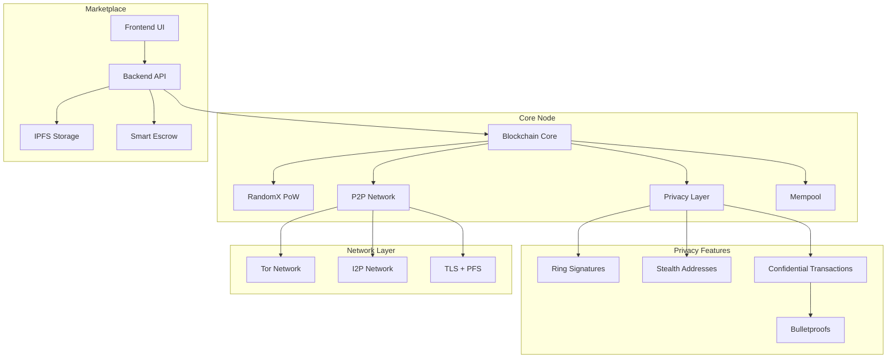

# BlackSilk Blockchain

## Overview

BlackSilk is a privacy-focused, censorship-resistant blockchain and decentralized marketplace inspired by Monero, Bitcoin, and the Silk Road. It features a Rust-based node, miner, and wallet, and a Next.js-based frontend. The project emphasizes strong cryptography, anonymous networking, and a robust, open-source stack.

---

## Table of Contents
- [Architecture & System Diagram](#architecture--system-diagram)
- [Tokenomics: Block Reward, Emission, Block Time](#tokenomics-block-reward-emission-block-time)
- [Component Overview](#component-overview)
- [Marketplace, Escrow & Reputation](#marketplace-escrow--reputation)
- [Wallet Features & CLI](#wallet-features--cli)
- [Build & Usage Instructions](#build--usage-instructions)
- [What’s Finished](#whats-finished)
- [What’s Under Construction](#whats-under-construction)
- [Security & Privacy](#security--privacy)
- [Advanced Features](#advanced-features)
- [Roadmap](#roadmap)
- [References & Docs](#references--docs)
- [License](#license)

---

## Architecture & System Diagram



---

## Tokenomics: Block Reward, Emission, Block Time

| Parameter         | Value                        |
|------------------|------------------------------|
| **Block Reward** | 5 BLK (initial, halves every 1,051,200 blocks) |
| **Block Time**   | 120 seconds (2 minutes)      |
| **Halving**      | Every 1,051,200 blocks (~4 years) |
| **Supply Cap**   | 21,000,000 BLK               |
| **Tail Emission**| None (miners get only fees after cap) |
| **Premine/ICO**  | None                         |
| **Consensus**    | RandomX Proof-of-Work (CPU-optimized) |

**Emission Schedule:**
- Block reward halves every 1,051,200 blocks (~4 years).
- After 21M BLK are mined, no new coins are created; miners receive only transaction fees.
- No premine, no perpetual emission, no ICO.

**Emission Logic Reference:**
- See `node/src/lib.rs` and `docs/architecture.md` for the `EmissionSchedule` struct and consensus rules.

---

## Component Overview

- **Node:** Rust, CLI, data-dir, genesis block, block/tx validation, `/get_blocks` endpoint, P2P, privacy enforcement.
- **Miner:** Rust, RandomX PoW, CLI, benchmarking, Huge Pages, full performance flags, real-time hashrate.
- **Wallet:** Rust, BIP39 mnemonic, stealth address, persistent wallet file, node sync, balance, CLI for all major ops, hardware wallet scaffold.
- **Marketplace Frontend:** Next.js, static generation, privacy-first, Silk Road-inspired UI, IPFS integration.
- **Marketplace Backend:** Rust (Axum)/Python (planned), REST API, escrow, reputation, IPFS, Tor/I2P.
- **Primitives:** Core cryptographic types, ring signatures, Bulletproofs, confidential transactions, escrow logic.

---

## Marketplace, Escrow & Reputation

- **Listings:** Stored on IPFS, referenced by CID.
- **Orders:** Buyer/seller, amount, escrow contract, status.
- **Escrow:** Smart contract, 2-of-3 multisig (buyer, seller, arbiter), DAO voting for disputes, on-chain resolution.
- **Reputation:** On-chain reviews, average rating, decentralized arbitration.
- **Arbitration:** Community/DAO voting, dispute flow, transparent tally.

**Escrow Contract Flow:**
1. Buyer funds escrow.
2. Seller ships product.
3. Buyer confirms receipt.
4. Funds released to seller (2-of-3 signatures or DAO vote if disputed).

---

## Wallet Features & CLI

- **Key Generation:** BIP39 mnemonic, private/public spend/view keys, stealth address encoding (Blk...).
- **Persistent Storage:** All wallet data in `wallet_data/wallet.json`.
- **Node Sync:** Fetches blocks, scans for outputs, calculates balance.
- **Balance Calculation:** Scans all outputs for those matching wallet keys.
- **CLI Options:**
  - `--generate` (new wallet)
  - `--show-seed` (mnemonic)
  - `--show-keys` (private keys)
  - `--balance` (show balance)
  - `--send` (send coins)
  - `--node` (specify node address)
- **Security:** No private key or mnemonic is ever sent to the node; all scanning is local.
- **Hardware Wallet Integration:** Scaffolded for Ledger/Trezor (see `src/hardware.rs`).

**Wallet File Format:**
```json
{
  "mnemonic": "...",
  "priv_spend": "...",
  "priv_view": "...",
  "pub_spend": "...",
  "pub_view": "...",
  "last_height": 0,
  "address": "Blk..."
}
```

---

## Build & Usage Instructions

### Prerequisites
- Rust (latest stable)
- Node.js (for frontend)
- C++ toolchain (for RandomX miner)
- Python 3.x (for some backend tools)
- Tor/I2P (for privacy networking)

### Build All Components
- **Node:** `cargo build --release -p node`
- **Miner:** `cd miner && cargo build --release`
- **Wallet:** `cd wallet && cargo build --release`
- **Frontend:** `cd marketplace/frontend && npm install && npm run build`
- **Backend:** `cd marketplace/backend && cargo run --release` (or Python FastAPI, planned)

---

## What’s Finished

- [x] **Wallet:** BIP39 mnemonic, stealth address, persistent file, CLI (generate, show-seed, show-keys, balance, node sync), output scanning, robust parsing.
- [x] **Node:** CLI, data-dir, genesis block, block/tx validation, `/get_blocks` endpoint, P2P, emission schedule.
- [x] **Miner:** CLI, RandomX PoW, benchmarking, Huge Pages, full performance flags, real-time hashrate.
- [x] **Frontend:** Next.js, static generation, privacy-first, Silk Road-inspired UI, IPFS integration.
- [x] **Primitives:** Core cryptographic types, ring signatures, Bulletproofs, confidential tx, escrow logic.

---

## What’s Under Construction

- [ ] **Wallet:** Real key-based output scanning, outgoing tx, error handling, UX, file encryption, multi-account, hardware wallet.
- [ ] **Node:** Full tx scanning/validation, advanced privacy (ring sigs, Bulletproofs), dynamic fees, mempool, fork handling.
- [ ] **Miner:** Stratum support, pool mining, advanced benchmarking, Windows Huge Pages auto-setup.
- [ ] **Marketplace Backend:** Escrow, arbitration, IPFS, reputation, REST API, Tor/I2P.
- [ ] **General:** Production hardening, error handling, security audits, docs, testnet launch.

---

## Security & Privacy
- **Stealth Addresses:** Unique, unlinkable addresses for every payment.
- **Ring Signatures:** (Planned) Sender hidden among decoys.
- **Confidential Transactions:** (Planned) Amounts hidden using Bulletproofs.
- **No Private Data Leaks:** All scanning is local; no keys or seeds sent to the node.
- **Hardware Wallets:** Scaffolded for future support.
- **Network Privacy:** Tor/I2P enforced for all P2P/API connections.
- **Zero-Trace Mode:** No logs or sensitive data written to disk (except encrypted wallet files).
- **Full Security Headers:** All HTTP(S) responses include strict security headers.

---

## Advanced Features
- **IPFS Integration:** All files/images stored on IPFS, referenced by CID.
- **Zero-Trace Operation:** No persistent logs, privacy mode disables analytics/tracking.
- **On-chain Reputation & Arbitration:** DAO voting, on-chain reviews, transparent dispute resolution.
- **Dynamic Difficulty & Stratum:** Mining difficulty adjusts per share time, pool support (in progress).
- **Modular Architecture:** Node, wallet, miner, backend, frontend, all decoupled and testable.
- **Comprehensive Test Coverage:** Unit/integration tests for all primitives, escrow, ring sigs, etc.

---

## Roadmap
- [ ] **Wallet:** Real output scanning, transaction sending, hardware wallet, encryption, multi-account.
- [ ] **Node:** Full validation, mempool, dynamic fees, fork handling, advanced privacy.
- [ ] **Miner:** Stratum/pool, Windows Huge Pages auto, advanced benchmarking.
- [ ] **Marketplace Backend:** Escrow, arbitration, IPFS, REST API, Tor/I2P.
- [ ] **Docs:** Whitepaper, API docs, protocol specs, diagrams.
- [ ] **Testnet Launch:** Public testnet, bug bounties, audits.

---

## References & Docs
- [Architecture & Protocol](docs/architecture.md)
- [Advanced Features](docs/advanced_features.md)
- [Ring Signature Verification](docs/ring_signature_verification.md)
- [Node API (OpenAPI)](docs/api/openapi.yaml)
- [RandomX Algorithm](RandomX/README.md)
- [Marketplace Frontend](marketplace/frontend/README.md)

---

## License

BlackSilk is open-source and released under the MIT License. See `LICENSE` for details.

---

*This README is a living document and will be updated as the project evolves. For the latest details, see the `/docs` directory and the technical whitepaper.*
