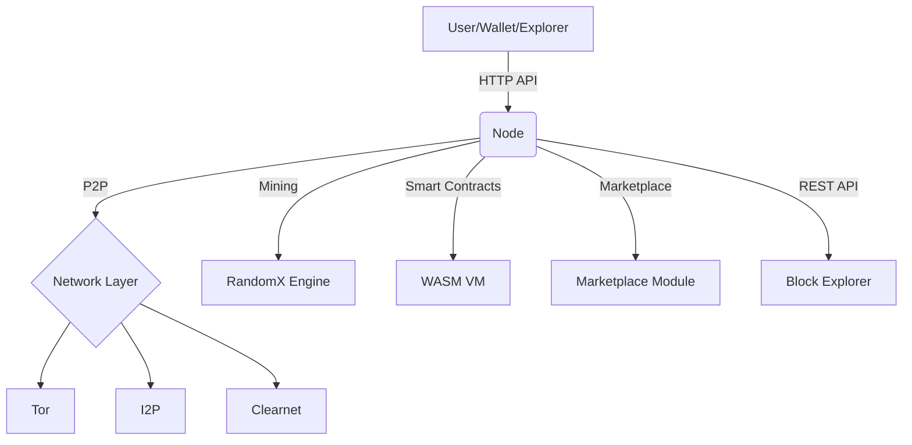
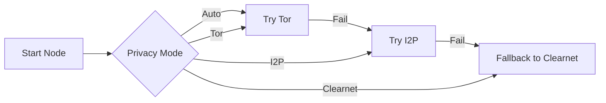

<!--
  NOTE: This is a professional, visually-rich README. For best results, ensure the following SVGs exist in docs/assets/:
    - blacksilk-logo.svg
    - architecture-diagram.svg
    - emission-curve.svg
  You may customize diagrams and branding as needed.
-->

# BlackSilk Blockchain & Block Explorer

<p align="center">
  
</p>

<p align="center">
  <b>Professional, Privacy-First Blockchain Platform & Modern Web Explorer</b><br>
  <i>Automatic privacy networking · Modern Rust codebase · Real-world utility · Next.js Explorer</i>
</p>

---

<p align="center">
  
</p>

---

## Table of Contents
- [Introduction](#introduction)
- [Architecture Overview](#architecture-overview)
- [Tokenomics](#tokenomics)
- [Privacy Networking](#privacy-networking)
- [Features](#features)
- [CLI Reference](#cli-reference)
- [Block Explorer](#block-explorer)
- [Project Structure](#project-structure)
- [Roadmap](#roadmap)
- [Development & Testing](#development--testing)
- [License](#license)
- [Contact & Community](#contact--community)

---

## Introduction
BlackSilk is a next-generation, privacy-first blockchain platform designed for real-world adoption. It combines advanced privacy networking (Tor, I2P, clearnet, auto-fallback), robust tokenomics, and a modern Rust codebase. BlackSilk is engineered for professionals, developers, and communities who demand uncompromising privacy, transparency, and utility.

---

## Architecture Overview



- **Node**: Core blockchain logic, consensus, mining, privacy management
- **Network Layer**: Automatic privacy routing (Tor, I2P, clearnet, fallback)
- **RandomX Engine**: ASIC-resistant, CPU-friendly mining
- **WASM VM**: Smart contracts (future)
- **Marketplace Module**: Confidential assets, encrypted memos (future)
- **Block Explorer**: Modern web UI (Next.js, TypeScript, Tailwind)

---

## Tokenomics

| Parameter         | Value                        |
|-------------------|-----------------------------|
| **Ticker**        | BLK                         |
| **Block Reward**  | 5 BLK (halves every 1,051,200 blocks) |
| **Block Time**    | 120 seconds (2 minutes)      |
| **Halving**       | Every 1,051,200 blocks (~4 years) |
| **Supply Cap**    | 21,000,000 BLK               |
| **Premine/ICO**   | None                        |
| **Tail Emission** | None (fees only after cap)   |

**Emission Curve:**

<p align="center">
  
</p>

---

## Privacy Networking

BlackSilk offers a seamless, professional privacy experience. Select your preferred mode at startup:

| Mode         | Description                                                      |
|--------------|------------------------------------------------------------------|
| clearnet     | Direct connections only                                          |
| tor          | Require Tor for all connections (auto-start, health-checked)     |
| i2p          | Require I2P for all connections (real I2P SAM client)            |
| auto         | Try Tor → I2P → clearnet (automatic fallback, default)           |

**Privacy Networking Flow:**



- **Tor**: Managed process, auto-start, health check, shutdown
- **I2P**: Real I2P SAM client, local or remote
- **Fallbacks**: Clearly logged, user feedback at startup and runtime

---

## Features

- **Privacy-First Networking**: Tor, I2P, clearnet, auto-fallback
- **RandomX Mining**: ASIC-resistant, CPU-friendly
- **Professional CLI**: Advanced privacy, mining, and network options
- **HTTP API**: REST endpoints for wallets, explorers, and apps
- **Advanced Peer Management**: Auto-discovery, banning, DNS, privacy-aware
- **Marketplace-Ready**: Encrypted memos, metadata, confidential assets (future)
- **Integration Tests**: End-to-end privacy fallback and connection logic
- **Comprehensive Logging**: Startup banner, privacy status, error feedback
- **Modular Rust Codebase**: Easy to extend and audit

---

## CLI Reference

```powershell
# Start node in auto privacy mode (default)
cargo run --bin blacksilk-node -- --net-privacy auto

# Start node in Tor-only mode (Tor must be running)
cargo run --bin blacksilk-node -- --net-privacy tor

# Start node in I2P-only mode (I2P SAM must be running)
cargo run --bin blacksilk-node -- --net-privacy i2p

# Start node in clearnet mode
cargo run --bin blacksilk-node -- --net-privacy clearnet
```

**Key Options:**
- `--net-privacy [clearnet|tor|i2p|auto]` — Select privacy mode
- `--data-dir <DIR>` — Blockchain and node state directory
- `--network [mainnet|testnet]` — Network type
- `--bind <ADDR>` — HTTP API bind address
- `--p2p-bind <ADDR>` — P2P network bind address
- `--connect <ADDR>` — Connect to peer(s)
- `--mining` — Enable internal miner
- `--mining-threads <N>` — Mining threads
- `--mining-address <ADDR>` — Mining payout address
- `--tor-hidden-service` — Enable Tor hidden service
- `--tor-proxy <ADDR>` — Tor SOCKS proxy address
- `--i2p-enabled` — Enable I2P support
- `--i2p-sam <ADDR>` — I2P SAM bridge address
- `--log-level [error|warn|info|debug|trace]` — Logging verbosity
- `--help` — Show all options

---

## Block Explorer

A modern, responsive web-based block explorer for the BlackSilk Blockchain. Built with Next.js, TypeScript, and Tailwind CSS.

### Features
- **Real-time Network Statistics**: Live block height, difficulty, hashrate, peer count
- **Block Browser**: Detailed block information with transaction lists
- **Transaction Viewer**: Complete transaction details with privacy features
- **Address Lookup**: Balance and transaction history for addresses
- **Mempool Monitor**: View pending transactions
- **Smart Search**: Search by block height, hash, transaction ID, or address
- **Modern UI**: Responsive, dark/light theme, fast loading, real-time updates
- **Privacy Indicators**: Ring signature and stealth address detection, privacy level labels
- **Advanced Analytics**: Network charts, mining info, supply metrics, halving countdown

### Quick Start

```powershell
# Clone the repository
cd BlackSilk-Blockchain/block-explorer
npm install
cp .env.example .env.local
# Edit .env.local as needed
npm run dev
```

### API Integration

The explorer connects to the BlackSilk node's HTTP API:
- `/status` — Network info
- `/get_blocks` — Block list
- `/get_block/{hash|height}` — Block details
- `/get_transaction/{txid}` — Transaction details
- `/get_mempool` — Pending transactions
- `/search?q={query}` — Search

### Deployment
- **Docker:** `docker build -t blacksilk-explorer . && docker run -d -p 3002:3002 blacksilk-explorer`
- **Production:** See block-explorer/README.md for full details

---

## Project Structure

```text
BlackSilk-Blockchain/
├── node/           # Core node (Rust)
│   ├── src/
│   │   ├── main.rs           # CLI, privacy manager, Tor/I2P integration
│   │   ├── lib.rs            # Consensus, chain, emission, config
│   │   ├── network/
│   │   │   ├── privacy.rs    # Privacy manager, fallback logic
│   │   │   └── tor_process.rs# Tor process management
│   │   └── ...
├── i2p/            # Local I2P SAM client crate
├── miner/          # Standalone RandomX miner (Rust CLI)
├── wallet/         # Privacy wallet (Rust CLI)
├── block-explorer/ # Modern web explorer (Next.js, TypeScript)
├── marketplace/    # Marketplace module (Rust + Next.js frontend)
├── monitoring/     # Prometheus, Grafana, alerting
├── tests/          # Integration and e2e tests
├── config/         # Example configs
├── mainnet/        # Mainnet bootnodes, chain spec
├── testnet/        # Testnet bootnodes, chain spec
├── Cargo.toml      # Workspace manifest
└── README.md       # This file
```

---

## Roadmap

### Accomplished
- Modernized workspace and dependencies
- Integrated real I2P protocol (SAM client)
- Refactored privacy manager for auto/fallback
- Professional Tor process management
- CLI privacy mode and config refactor
- Integration and fallback tests
- Enhanced user feedback and logging
- Updated documentation and CLI help

### Pending / Future
- Smart contracts and programmable privacy (WASM)
- Marketplace and confidential assets
- Mobile and light wallet support
- Advanced analytics and explorer features
- Further privacy protocol research

---

## Development & Testing
- **Build:** `cargo build --release`
- **Test:** `cargo test`
- **Integration tests:** See `tests/integration/e2e/`
- **Run node:** See CLI examples above
- **Block Explorer:** See block-explorer/README.md for dev & deployment

---

## License
MIT License. See [LICENSE](LICENSE).

---

## Contact & Community
- [GitHub](https://github.com/blacksilk-org/BlackSilk-Blockchain)
- [Discord](https://discord.gg/blacksilk)
- [docs.blacksilk.io](https://docs.blacksilk.io)

---

<p align="center">
  <b>BlackSilk: Professional, privacy-first blockchain for the real world.</b>
</p>
