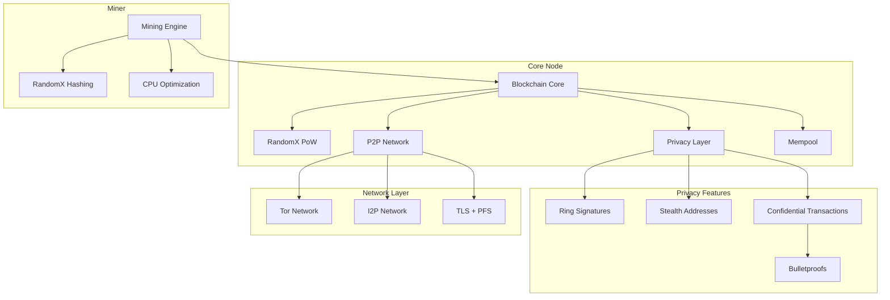

# BlackSilk Architecture Overview

## System Components

## Component Details

### 1. Core Node (`node/src/`)
- Blockchain state management
- Block validation and consensus
- RandomX proof-of-work verification
- P2P networking and synchronization
- Transaction pool management
- Privacy protocol implementation

### 2. Wallet (`wallet/src/`)
- Key generation and management
- Transaction creation and signing
- Ring signature generation
- Stealth address handling
- Hardware wallet integration
- CLI and RPC interfaces

### 3. Primitives (`primitives/src/`)
- Core cryptographic types
- Transaction structures
- Block structures
- Ring signature types
- Stealth address types
- Bulletproof range proof types

### 4. Miner (`miner/src/`)
- RandomX mining implementation
- CPU-optimized hash computation
- Mining pool connectivity
- Performance optimization
- Block template processing

### 5. Network Privacy (`node/src/network/`)
- Tor hidden service integration
- I2P destination management
- TLS with Perfect Forward Secrecy
- P2P protocol encryption
- Network address privacy
- Order management
- Responsive design
- Privacy-preserving analytics

## Data Flow

### Transaction Flow
1. Wallet creates transaction with:
   - Ring signature (input privacy)
   - Stealth address (output privacy)
   - Confidential amount (Bulletproofs)
2. Transaction submitted to node
3. Node validates and broadcasts
4. Miners include in blocks
5. Network reaches consensus

### Mining Flow
1. Miner requests block template from node
2. Miner computes RandomX hash with varying nonce
3. Valid hash submitted to node
4. Node validates and broadcasts block
5. Network reaches consensus

## Security Considerations

### Node Security
- No clearnet leaks in Tor/I2P mode
- All P2P communications encrypted
- No logging of sensitive data
- Secure memory handling
- DoS protection

### Wallet Security
- Encrypted key storage
- Hardware wallet support
- Secure RPC
- Memory wiping
- Backup functionality

### Miner Security
- Secure RandomX implementation
- Memory-safe operations
- DoS protection
- Performance isolation

## Development Guidelines

### Code Organization
- Modular architecture
- Clear separation of concerns
- Comprehensive test coverage
- Consistent error handling
- Documentation requirements

### Contribution Process
1. Issue discussion
2. Design review
3. Implementation
4. Testing
5. Security review
6. Code review
7. Merge

## Future Considerations

### Scalability
- Layer 2 solutions
- Optimized block propagation
- IPFS clustering
- API load balancing

### Privacy Enhancements
- zk-SNARKs integration
- Improved stealth addresses
- Enhanced network privacy
- Advanced ring signature schemes

### Mining Improvements
- GPU resistance validation
- ASIC resistance monitoring
- Performance optimizations
- Pool mining protocols

### Emission Schedule & Tokenomics
BlackSilk’s emission model is designed for fairness and long-term sustainability:
- **Block Reward:** Starts at 5 BLK per block.
- **Halving:** Every 1,051,200 blocks (~4 years), the block reward halves.
- **Supply Cap:** Hard cap of 21,000,000 BLK. No new coins are created after this cap is reached.
- **No Tail Emission:** After the cap, miners are paid only transaction fees. There is no perpetual emission.
- **No Premine/ICO:** All coins are distributed via mining.
- **Dynamic Fees:** After the cap, network security is maintained by transaction fees, which are dynamically adjusted based on network demand and block space.

#### Emission Logic (Code Reference)
- See `node/src/lib.rs` for the `EmissionSchedule` struct and `block_reward` logic.
- The emission schedule is enforced at the consensus layer; any block with an invalid reward is rejected.
- The fee model is designed to be flexible for future upgrades (e.g., EIP-1559-style dynamic fees).